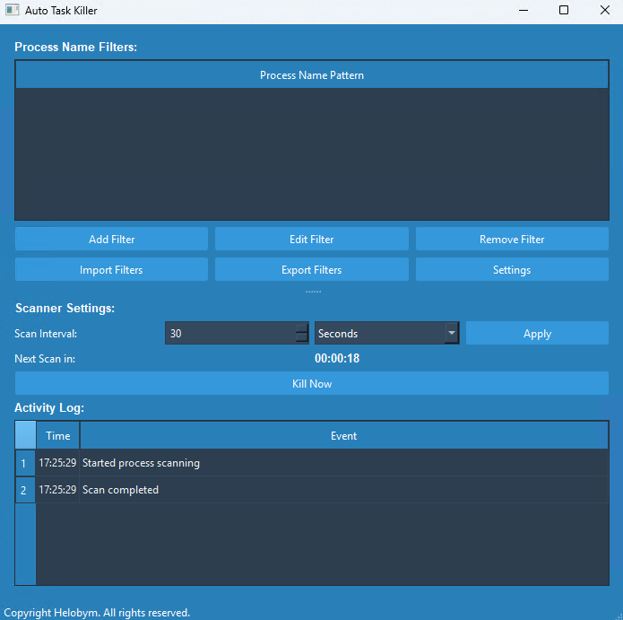

This software is developed by [Helobym](https://helobym.com)

Auto Task Killer is a powerful system optimization utility designed to automatically monitor and terminate unwanted background processes on your Windows computer. This sleek application runs silently in your system tray, continuously scanning for resource-draining applications based on your custom filter settings.

[Demo Video](https://youtu.be/pJZhMXc_3mg)

